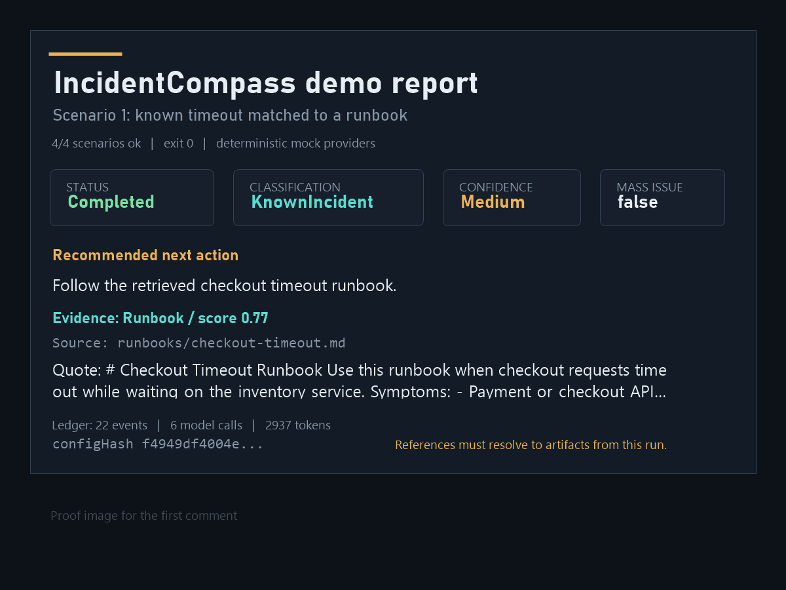

# IncidentCompass

A .NET 10 backend that turns an incident signal into a reviewable, evidence-backed triage report.

IncidentCompass explores a narrow question: can an LLM choose useful investigation steps without
receiving authority over credentials, persistence or external side effects? The model may delegate
work and propose tool calls. The backend owns tool grants, budgets, evidence checks, the audit ledger
and the final report commit.

Version `v0.2.0` adds governed OTLP intake, memory synchronization, immutable report history,
server-owned incident tenancy and operational hardening.

## One Investigation

1. The API accepts native OTLP trace/log protobuf exports or an OTel-shaped, user or tester signal, redacts sensitive fields, groups it into a
   fault and creates a durable triage job.
2. The Worker claims the job and reloads the exact versioned configuration captured at intake.
3. The orchestrator may delegate to analysis and memory workers. Each role receives only its configured
   tools, and every proposed call passes deterministic backend policy.
4. `publish_report` succeeds only when cited evidence resolves to allowed artifacts from the same
   job and, for attempt-scoped artifacts, the current attempt. Policy decisions, model calls, tool activity and publication are recorded in the ledger.

The screenshot is from the deterministic `v0.1.1` demo: a `KnownIncident` report with one cited
runbook and 22 ledger events. It demonstrates the backend path and review surface, not classification
accuracy for arbitrary models or incidents.

## Try The Local Flow

The normal local path uses OpenAI-compatible chat and embedding endpoints. On Windows and macOS,
Docker Compose points to `host.docker.internal:1234` by default.

~~~powershell
Copy-Item .env.example .env
# Set exact model ids in .env when your provider requires them.
dotnet run --project src/IncidentCompass.Api -- config validate
powershell -ExecutionPolicy Bypass -File scripts/demo.ps1
~~~

The script builds PostgreSQL, API, Worker and Tester containers, runs the local scenarios and prints
URLs for the fault ledger and triage report. Use `scripts/demo.ps1 -Mock` only when you need the
fully deterministic mock path. The configurable ingestion payload limit must be between 1 KiB and 1 MiB. The upper bound caps per-request buffering; the 1 KiB lower bound prevents a misconfiguration that rejects ordinary small OTLP exports. `MaxAttributesBytes` must be positive and no greater than `MaxPayloadBytes`. The default limits are 64 KiB and 16 KiB. See [Quickstart](docs/quickstart.md) and
[Local demo walkthrough](docs/local-demo.md) for provider settings, port overrides and manual steps.

## What The Demo Proves

- The orchestration loop is bounded by backend-owned worker, token, wall-clock and reprompt budgets.
- Worker tools are role-scoped and fail closed when they are unknown, ungranted or denied by policy.
- Report evidence is resolved against stored artifacts instead of trusting model-authored citations.
- The investigation can be reconstructed from durable ledger and configuration snapshot records.
- Automated tests remain deterministic and do not call real providers by default.

Model quality is separate from these guarantees. A weak or incompatible model may still fail to
complete the multi-turn trajectory or reach a correct conclusion.

## Current Implementation

- Layered-monolith .NET 10 application with Clean Architecture boundaries and a lightweight internal
  dispatcher/pipeline.
- Signal intake with source normalization, configurable redaction, fingerprinting, grouping, triage
  job creation and grounded intake artifacts.
- OpenAI-compatible model and embedding adapters for the normal runtime path, with explicit mock
  adapters for tests and deterministic checks.
- Configured orchestrator and worker roles, typed output schemas, role-scoped tools and ledger-backed
  policy decisions.
- PostgreSQL/pgvector incident memory with governed `memory_search`, file-backed seed identity and snapshotted per-service current-release markers for documentation fit.
- Governed `source_lookup` over explicitly configured local checkouts, with backend-selected release
  and stack frames, bounded text excerpts and grounded `RetrievedItem` citations carrying a closed
  `SourceCode` artifact payload.
- Governed read-only `ticket_search` through a system-neutral Application port and a GitHub Issues
  adapter with a fixed API authority, configured repository, deterministic bounded ranking and
  grounded `ExistingTicket` citations.
- Optional host-configured API-key authentication for API-v1 data and native OTLP routes, with
  server-side key-to-tenant binding, deny-by-default endpoint coverage and queue-free per-key
  fixed-window limits. Auth-disabled demo mode remains local-only.
- Durable, tenant-scoped post-report action proposals with immutable approval-contract hashes,
  closed provenance, lifecycle audit events and API-key-only list, get, approve and reject APIs.
  A backend-owned proposal use case reuses the same rule engine as immediate reads, enforces exact
  registered action identity and snapshotted action grants, and creates requested or auto-approved
  rows without invoking an adapter. Synthetic tests are the only caller in this slice; there is no
  production proposal caller, action pump or external provider call.
- Backend-grounded triage reports plus fault, report and ledger read APIs.
- Docker Compose packaging with a stock OTel Collector route and an HTTP-only Tester that does not reference application assemblies.
- Server-owned incident-data tenant scope for intake and fault/report/ledger reads; demo tenant headers are never trusted.

## Code Walkthrough

- [Signal intake handler](src/IncidentCompass.Application/Intake/IngestSignal/Handler.cs) - normalizes,
  redacts, groups and persists an incoming signal.
- [Governed investigation processor](src/IncidentCompass.Application/Investigation/Jobs/GovernedTriageInvestigationProcessor.cs) -
  runs the bounded orchestrator/worker loop.
- [Shared tool rule engine](src/IncidentCompass.Application/Governance/Tools/ToolRuleEngine.cs) -
  applies configured grants and policy rules to immediate reads and post-report proposals.
- [Report evidence grounder](src/IncidentCompass.Infrastructure/Investigation/PostgresReportEvidenceGrounder.cs) -
  resolves model-proposed references against citable artifacts from the active attempt.

## How This Was Built

Implementation and refactoring were heavily assisted by coding agents. Igor Lagutin owned the
product scope, architecture, task decomposition, acceptance criteria, review decisions and release
gates. Generated changes were treated as untrusted until the relevant build, tests, Docker scenarios,
code-organization checks and vulnerability gate passed.

Failures and trade-offs stay visible in the repository. The recorded real-model smoke results include
unsuccessful runs instead of presenting only the best outcome.

## Architecture

~~~mermaid
flowchart LR
    Client["Client / API consumer"] --> Api["IncidentCompass.Api"]
    Tester["IncidentCompass.Tester"] --> Api
    Api --> App["IncidentCompass.Application"]
    Worker["IncidentCompass.Worker"] --> App
    App --> Domain["IncidentCompass.Domain"]
    Infrastructure["IncidentCompass.Infrastructure"] --> App
    Infrastructure --> Postgres["PostgreSQL + pgvector"]
    Infrastructure --> Providers["OpenAI-compatible providers"]
    Infrastructure --> TestProviders["Mock providers (tests only)"]
~~~

`IncidentCompass.Application` is organized by feature folder: `Core`, `Governance`, `Intake`,
`Investigation`, `Memory`, `SourceContext` and `Tickets`. `Infrastructure` implements persistence, provider, configuration and
memory adapters. The API remains transport-focused. The Worker owns job claiming and governed
background processing. Tester is an external HTTP client for the local scenarios.

Local source lookup is disabled operationally until a host configures an exact
`IncidentCompass:SourceContext:Roots` entry containing `ServiceName`, `Release` and an absolute
`RootPath`. Optional absolute `BuildPathPrefixes` translate known build-agent paths only on path
segment boundaries. The selected release still comes exclusively from the snapshotted
`CurrentReleases` entry for the fault service. Removing the `source` role or its `source_lookup`
grant from triage configuration removes the tool from the model surface.

GitHub Issues search is disabled operationally until the Worker host receives
`IncidentCompass__Tickets__GitHub__Owner`, `IncidentCompass__Tickets__GitHub__Repository` and the
secret `IncidentCompass__Tickets__GitHub__Token`. The token is a host secret and does not enter the
public triage configuration or its snapshots. Requests always target `https://api.github.com` with
redirects disabled. Removing the `tickets` role or its `ticket_search` grant removes the tool from
the model surface. Ticket create/update is not part of this read-only integration.

API-key authentication is disabled by default for the local walkthrough. A non-local API host must
enable `IncidentCompass__ApiKeyAuth__Enabled`, set startup-static `PermitLimit` and `WindowSeconds`,
and inject one or more credential entries containing only a stable key id, tenant id and SHA-256
hex digest. Clients send the corresponding 32-128 character base64url secret in exactly one
`X-IncidentCompass-Key` header. See [Security model](docs/security-model.md) for reload, tenant and
rate-limit behavior. Do not place a raw key in tracked configuration.

Action approval routes are always stricter than the local walkthrough. The entire
`/api/v1/action-approvals` group returns `403` when API-key authentication is disabled. When it is
enabled, any valid host-issued key is the minimal action operator for its mapped tenant until a later
RBAC slice. Demo headers and the config-default tenant never grant action review authority.

Start with [Architecture](docs/architecture.md), [Security model](docs/security-model.md),
[Observability](docs/observability.md) and [Trade-offs](docs/trade-offs.md).

## Scope And Limits

IncidentCompass is reference-quality software for local review, not a production incident platform.
The current scope provides a minimal host-managed API-key boundary, not enterprise identity, RBAC,
managed key distribution or a secret store. It also does not provide a stable extension framework,
a UI, external action dispatch or provider adapters, an MCP surface, a usage dashboard or a general
document-ingestion system. The action approval API records and reviews frozen proposals; it does not
itself execute them.
Demo auth and Compose defaults remain local-only; non-local operators must inject high-entropy key
digests through protected host configuration and apply the usual transport and deployment controls.

## Documentation

- [Quickstart](docs/quickstart.md)
- [Local demo walkthrough](docs/local-demo.md)
- [Architecture](docs/architecture.md)
- [Security model](docs/security-model.md)
- [Model gateway](docs/model-gateway.md)
- [Observability](docs/observability.md)
- [Code organization](docs/code-organization.md)
- [Versioning and release flow](docs/versioning.md)
- [Release candidate notes for v0.2.0](docs/release-notes-v0.2.0.md)
- [Published v0.1.1 notes](docs/release-notes-v0.1.1.md)

## Relationship To dotnet-genai-starter

IncidentCompass was bootstrapped from the
[dotnet-genai-starter](https://github.com/ilagutin/dotnet-genai-starter) repository's layered .NET
structure and model/embedding gateway boundaries. It was then specialized into one incident-triage
workflow. Chat, general RAG document ingestion, evaluations, usage dashboards and MCP product
surfaces were removed because they do not belong to this project's scope.
