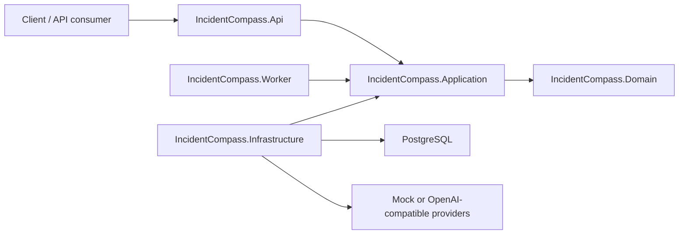

# IncidentCompass

A governed incident-triage agent backend. The intended shape: ingest a signal, an
orchestrator delegates to scoped workers under policy/audit/budget rails, and the
system produces a grounded report.

This is reference-quality software, not a production system. This snapshot includes the
Phase 0 repository bootstrap, Phase 1 intake, the Phase 2 governed investigation loop and Phase 3 governance rails:
typed triage configuration rehydration, a durable triage ledger writer, a bounded Worker
claim loop, deterministic analysis delegation and a minimal `publish_report` closeout. The
full grounded report pipeline remains later Phase 5 work.

## What This Is

- A layered-monolith .NET 10 skeleton using Clean Architecture and a lightweight internal
  application pipeline.
- A model/embedding gateway abstraction with deterministic mock providers (default) and
  OpenAI-compatible adapters behind the same ports.
- A Phase 1 intake pipeline (`Intake`) with `POST /api/v1/incidents`, `GET /api/v1/faults/{id}`,
  source normalizers, redaction, fingerprinting, fault grouping, triage-job creation and
  grounded intake artifacts.
- A governed tool-execution/policy/audit subsystem (`Governance`): typed tool schemas,
  backend policy decisions (allow/require-approval/forbid), a durable triage ledger writer
  and an older standalone tool-audit log writer. The Phase 2 investigation loop uses the
  ledger for `Delegated`, `WorkerCompleted` and `ReportPublished` events.
- Sanitized AI-request logging, cost estimation, and generic dispatch/health/security/user
  scaffolding over PostgreSQL.

## What This Is Not

- Not a chat backend, a RAG/document-ingestion system, an evaluation harness, a usage
  dashboard, or an MCP host/client. All of that existed in the upstream starter kit and was
  deliberately removed here.
- Not a full framework with stable public extension contracts.
- Not production-ready as-is: demo auth and mock providers are intentionally replaceable
  adapters with no battle-testing and no SLA.

## Architecture



`IncidentCompass.Application` is a single project organized by feature folder: `Core/`
(dispatcher, identity/correlation, model/embedding gateway abstractions, options),
`Governance/` (tool-execution policy plus the triage ledger), `Intake/` (signal
normalization, redaction, fingerprinting, fault grouping and triage-job orchestration) and
`Investigation/` (Worker claim/runtime orchestration, config rehydration and the governed
Phase 2 processor) are populated today. `Memory/` remains reserved for later phases.
`Infrastructure` implements persistence and provider adapters. `Api` maps HTTP input/output
only. `Worker` polls PostgreSQL, claims bounded triage jobs and runs the configured
orchestrator with only `delegate` and `publish_report` available.

Start here:

- [Architecture](docs/architecture.md)
- [Application pipeline](docs/application-pipeline.md)
- [Versioning](docs/versioning.md)
- [Trade-offs](docs/trade-offs.md)

## Documentation

- [Quickstart](docs/quickstart.md)
- [Security model](docs/security-model.md)
- [Model gateway](docs/model-gateway.md)
- [Cost tracking](docs/cost-tracking.md)
- [Observability](docs/observability.md)
- [Code organization](docs/code-organization.md)
- [Phase 2 implementation report](docs/phase-2-implementation-report.md)
- [Phase 3 implementation report](docs/phase-3-implementation-report.md)

## Target Stack

- .NET 10 LTS.
- ASP.NET Core.
- PostgreSQL.
- Docker Compose.
- OpenAI-compatible model and embedding clients.
- Mock model and embedding clients for tests.
- xUnit, Testcontainers for integration tests.

## Project Structure

```text
src/
  IncidentCompass.Api
  IncidentCompass.Application
  IncidentCompass.Domain
  IncidentCompass.Infrastructure
  IncidentCompass.Worker
tests/
  IncidentCompass.UnitTests
  IncidentCompass.IntegrationTests
```

## Quickstart

See [docs/quickstart.md](docs/quickstart.md) for the full local setup and provider
override examples.

Minimal local path:

```powershell
Copy-Item .env.example .env
dotnet restore IncidentCompass.slnx
dotnet build IncidentCompass.slnx
dotnet test IncidentCompass.slnx
docker compose up -d postgres
```

Run the API and Worker in separate terminals. Set the connection string in each
terminal because PowerShell process environment variables are not shared across
new windows:

```powershell
$env:ConnectionStrings__IncidentCompass = "Host=localhost;Port=5432;Database=incidentcompass;Username=incidentcompass;Password=incidentcompass_dev_password"
dotnet run --project src/IncidentCompass.Api --launch-profile http
```

```powershell
$env:ConnectionStrings__IncidentCompass = "Host=localhost;Port=5432;Database=incidentcompass;Username=incidentcompass;Password=incidentcompass_dev_password"
dotnet run --project src/IncidentCompass.Worker
```

Sample HTTP requests (health check, current-user lookup, incident ingestion, source rejection
and fault lookup) are available in
[src/IncidentCompass.Api/IncidentCompass.Api.http](src/IncidentCompass.Api/IncidentCompass.Api.http)
and [samples/http/local-demo.http](samples/http/local-demo.http).

## Relationship to dotnet-genai-starter

IncidentCompass was bootstrapped from the `dotnet-genai-starter` repo's patterns: its
layered .NET structure, its model/embedding gateway abstractions, and its governed
tool-execution/policy/audit primitive. It was then specialized into a single-purpose
incident-triage agent. Everything else from that starter kit — chat (direct, RAG, and
agentic), RAG document ingestion, evaluations, usage tracking, and MCP (both the local host
and the external-MCP client) — was stripped out because it doesn't belong to this product's
scope.

This is reference-quality, not production, software: no battle-testing, no SLA, and the
demo adapters (header-based demo auth, mock providers) are intentionally replaceable rather
than deployment-ready.
