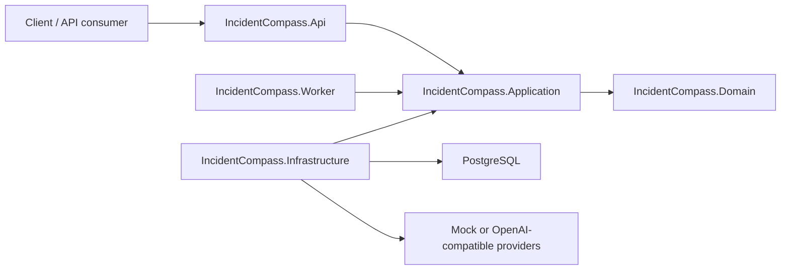

# Architecture

This project is a .NET-native governed incident-triage agent backend. It demonstrates production-aware patterns, but it is not a framework with stable public extension contracts.

The implementation is a layered monolith. The application layer is a single project organized into folders so the codebase stays easy to navigate as new capabilities are added (the layering is by convention and `ArchitectureTests`, not enforced module assemblies):

## Projects

- `IncidentCompass.Api`: HTTP endpoints, OpenAPI, demo auth adapter, request/response mapping.
- `IncidentCompass.Application`: single application project with populated feature folders:
  - `Core/`: dispatcher, pipeline behaviors, identity/correlation contracts, shared configuration, base errors, health echo, current-user use case, and model/embedding gateway abstractions.
  - `Governance/`: backend-governed tool-execution contracts, tool policy/audit orchestration and validation primitives. This subsystem is currently uncalled library code; a future phase wires a new caller into it.
  - `Intake/`: source normalization, input limits, redaction, fingerprinting, fault grouping, triage-job creation and grounded intake artifacts for the Phase 1 ingestion flow.
- `IncidentCompass.Domain`: simple domain records, enums and workflow state types shared by Application use cases.
- `IncidentCompass.Infrastructure`: PostgreSQL persistence adapters, intake repositories/config loading, model clients, embedding clients, sanitized AI request logging, pricing/cost estimation and other adapters.
- `IncidentCompass.Worker`: DB-backed background job host.

## Phase 1 Intake Flow

`POST /api/v1/incidents` accepts a small incident envelope. API mapping stays transport-only and dispatches `IngestSignalCommand`. Application validation checks configured source allow-list and payload size limits, normalizers produce a handler-ready signal shape, redaction removes obvious secrets while preserving null optional text fields, fingerprinting classifies signals as `Strong` only when both service name and structured `errorType` are present, and fault grouping either attaches to an open strong fault, suppresses a recent closed strong fault during the silence window, or opens a new fault and pending triage job.

The PostgreSQL schema added in `infra/postgres/init/007-intake.sql` stores `signals`, `faults`, `triage_jobs`, `triage_config_snapshots` and `triage_artifacts`. `triage_artifacts` currently carries job-level intake facts (`TriggerSignal`, `NeighborSet`, optional `PriorReport`) for later worker phases.

## Rules

- Domain must not depend on Application, Infrastructure, Api, Worker, provider SDKs or persistence libraries.
- Application owns use-case contracts, ports, orchestration, validation policies and pipeline behavior.
- Infrastructure implements application ports and owns the observability mechanism, including sanitized request logging and pricing/cost estimation.
- API and Worker hosts should call application use cases instead of duplicating orchestration.
- Provider SDKs must not appear in controllers or use-case handlers.
- Keep the system a layered monolith for this project's scope.

## Style

Use Clean Architecture with Domain-owned records and enums for shared workflow concepts, and Application-owned orchestration, validation policies and pipeline behavior. FluentValidation is the request-validation framework, and the internal dispatcher runs pipeline behaviors for cross-cutting concerns such as request logging and validation before handlers execute. Use CQRS-lite where it improves clarity, but avoid separate read/write stores, event sourcing and ceremony that does not serve the project.

Follow `docs/code-organization.md` for maintainability guardrails. In short: keep classes small, keep one entity per file, split unrelated responsibilities, and keep application handlers focused on use-case orchestration.
