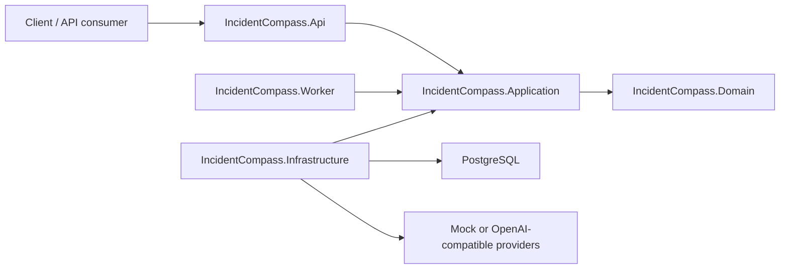

# Architecture

This project is a .NET-native governed incident-triage agent backend. It demonstrates production-aware patterns, but it is not a framework with stable public extension contracts.

The implementation is a layered monolith. The application layer is a single project organized into folders so the codebase stays easy to navigate as new capabilities are added (the layering is by convention and `ArchitectureTests`, not enforced module assemblies):

## Projects

- `IncidentCompass.Api`: HTTP endpoints, OpenAPI, demo auth adapter, request/response mapping.
- `IncidentCompass.Application`: single application project with populated feature folders:
  - `Core/`: dispatcher, pipeline behaviors, identity/correlation contracts, shared configuration, base errors, health echo, current-user use case, and model/embedding gateway abstractions.
  - `Governance/`: worker policy helpers, validation primitives, dormant standalone tool-execution/audit primitives and the durable triage ledger append contract.
  - `Intake/`: source normalization, input limits, redaction, fingerprinting, fault grouping, triage-job creation and grounded intake artifacts for the Phase 1 ingestion flow.
  - `Investigation/`: Worker job claim/runtime seams that rehydrate claimed jobs by config hash and hand them to the governed investigation processor.
  - `Memory/`: memory search contracts, seed records and the governed `memory_search` worker tool.
- `IncidentCompass.Domain`: simple domain records, enums and workflow state types shared by Application use cases.
- `IncidentCompass.Infrastructure`: PostgreSQL persistence adapters, intake repositories/config loading, model clients, embedding clients, memory adapters, dormant pricing/audit adapters and other infrastructure adapters.
- `IncidentCompass.Worker`: DB-backed background job host with PostgreSQL polling, renewable ownership-fenced leases, cancellation on ownership loss and per-process `MaxConcurrentJobs`.

## Phase 1 Intake Flow

`POST /api/v1/incidents` accepts a small incident envelope. API mapping stays transport-only and dispatches `IngestSignalCommand`. Application validation checks configured source allow-list and payload size limits, normalizers produce a handler-ready signal shape, redaction removes obvious secrets while preserving null optional text fields, and fingerprinting classifies signals as `Strong` only when both service name and structured `errorType` are present. `FaultGrouping.FingerprintRules` can select service, operation and source-specific normalized inputs through an ordered deterministic rule set; every resulting signal, fault and `NeighborSet` records the effective rule id and version, so a later rule generation cannot merge into its predecessor. Fault grouping then either attaches to an open strong fault in that exact generation, applies the deterministic service/severity policy selected from `FaultGrouping.SuppressionRules` to suppress a recent closed strong fault, or opens a new fault and pending triage job. Each signal and `NeighborSet` records the effective policy id and window; unmatched signals use the `default` policy with the global `SilenceWindowMinutes`, while the stable suppression reason remains `silence_window`.
These are four separate intake decisions. Delivery deduplication returns the already accepted signal for the same tenant, source and delivery key, so retries do not change any facts. Open-fault grouping attaches a different accepted signal to the one open fault for its exact fingerprint-rule generation. Suppression stores a different accepted signal against a recently closed fault without opening a job. A later, non-suppressed recurrence opens one recurrence fault and job; every distinct accepted signal attached to that open recurrence increments the transactionally locked group-generation recurrence state. The state stores first and last recurrence timestamps and creates at most one escalation intent for its configured threshold. `RecurrenceState` is a job-level citable artifact and is replaced when an attached signal advances the state. A duplicate delivery never advances recurrence state or creates an escalation intent.

Incident-data tenancy is resolved by the server-owned `IIncidentTenantContext`, not by `IUserContext` or sender-controlled envelope and OTLP fields. For v0.2.0 the context returns `Ingestion.DefaultTenant`, consistently for manual and OTLP intake. This gives the local sample one explicit data partition while leaving authentication to a later API-key adapter.

## OTLP Ingestion

The API also exposes standard OTLP/HTTP protobuf endpoints at `POST /v1/traces` and `POST /v1/logs`.
The transport adapter is deliberately confined to `IncidentCompass.Api`: it decodes the pinned upstream
OTLP protobuf schema, maps resource, span or log attributes into `IngestSignalCommand`, then dispatches
the existing `otel` normalizer. OTLP/protobuf concepts do not enter Domain or Application contracts.

Only `application/x-protobuf` and `application/protobuf` requests are currently accepted. Metrics,
profiles, protobuf JSON and compressed OTLP payloads are not supported by this release. The `Ingestion.Otel`
configuration controls error-only, service and severity trigger filters; an empty allow-list means no filter.
Ignored telemetry returns a valid empty OTLP response and does not create a signal or triage job. A delivery
key derived from `externalId`, or from trace plus span when no external ID exists, is unique per tenant and
source, so exporter retries return the accepted signal rather than adding a neighbor or job.
The PostgreSQL schema added in `infra/postgres/init/007-intake.sql` stores `signals`, `faults`, `triage_jobs`, `triage_config_snapshots` and `triage_artifacts`. `triage_artifacts` carries job-level intake facts (`TriggerSignal`, `NeighborSet`, optional `RecurrenceState` and optional `PriorReport`) plus attempt-level `WorkerOutput`, `RetrievedItem` and `ToolResult` artifacts. Phase 2 adds `infra/postgres/init/008-triage-ledger.sql` for append-only DB-ordered triage events. Phase 5 evolves `infra/postgres/init/009-triage-reports-minimal.sql` into grounded `triage_reports` plus `triage_evidence` persistence. The Worker claim loop leases pending/retryable jobs, rehydrates each job's triage configuration from `triage_config_snapshots` by `config_hash`, runs a governed orchestrator with only `delegate(role, task)` and `publish_report(report_json)`, validates `delegate.role` against the config-derived role set, executes workers sequentially, enforces per-attempt budget and bounded reprompt policy, evaluates worker-tool rules over the ledger, and closes the job/fault only when backend-grounded report publication commits.

## Phase 4 Memory Worker

Phase 4 adds PostgreSQL-backed incident memory through `incidentcompass.memory_items` and `incidentcompass.memory_chunks`. File-backed memory sync reads runbooks, known incidents, operational notes, release notes and postmortems with optional service/component/release metadata. Within a configured seed owner, source path is the stable identity: changed files update and re-embed one active item, while removed files are deactivated and excluded from search. Each complete corpus is published atomically as an owner-scoped generation, so a divergent owner cannot deactivate another owner's items. API and Worker can sync the same owner concurrently under a corpus database lock. Runtime resync is opt-in, single-flight and cancellation-aware; it persists only timestamps, generation and a sanitized error code by seed tenant and owner for the memory-sync health status, so the API can read the Worker-persisted synchronization snapshot across process boundaries; it is not a Worker liveness probe. The manual `CurrentReleases` map is the single per-service release marker: memory retrieval labels matching evidence as current, stale, unversioned or service-mismatched before it reaches the model. Report publication derives and verifies the stored documentation-fit status from those durable artifacts. The configured embedding model is used by default; the mock embedder is reserved for tests and explicit mock-only checks. The `memory` role is the only shipped role granted `memory_search`; the orchestrator never searches memory directly.

`memory_search` embeds the worker query through the tool's configured `EmbeddingRouteId`, then searches chunks with exact tenant, embedding provider, embedding model and embedding dimension filters before applying score and `TopK`. A model/provider/dimension mismatch returns an honest empty result instead of falling back to fuzzy retrieval. Successful matches are written as attempt-level `RetrievedItem` artifacts with `domain_ref = memory_item:<id>`, and those artifacts commit in the same transaction as the `ToolResult` artifact and ledger event.
## Phase 5 Grounded Reports

Phase 5 makes `publish_report` a backend-grounded closeout instead of a model-authored row write. The model supplies report fields and evidence `referenceId` values, but the backend validates the report shape, rejects non-citable or out-of-attempt references, derives `is_mass_issue` from the job-level `NeighborSet`, derives evidence kind from artifact state and `memory_items.kind`, and persists `triage_reports`, `triage_evidence`, job/fault terminal state and `ReportPublished` in one transaction. `WorkerOutput` artifacts are never citable. `GET /api/v1/triage-reports/{id}` returns the report and grounded evidence, including the cited artifact payload.

## Phase 6 Report Lifecycle

`infra/postgres/init/018-report-lifecycle.sql` makes published report rows immutable. Publication serializes on the fault row, inserts a new row with the producing job and an explicit `supersedes_report_id`, and never rewrites prior report content or evidence. `019-retriage-jobs.sql` adds an exactly-once recurrence trigger per source job and constrains its predecessor report to the same fault. When a recurrence escalation finds a prior report anywhere in its recurrence chain, intake creates a pending re-triage job for that reported fault in the same transaction, copies citable recurrence facts, and adds the prior report as an explicitly untrusted `PriorReport` artifact. A re-triage publication must cite `RecurrenceState`; it may independently classify the incident differently. The report detail response exposes predecessor, successor and latest-chain state. `GET /api/v1/faults/{faultId}/triage-report` returns the newest chain head while `GET /api/v1/triage-reports/{id}` continues to retrieve any historical report. `GET /api/v1/triage-reports` returns compact report summaries only, ordered by `(createdAtUtc DESC, reportId DESC)` with a bounded opaque keyset cursor. It supports fault, service, environment, status and classification filters and exposes predecessor, successor and latest-chain fields without evidence payloads. All fault, ledger and report reads are tenant-scoped; out-of-scope objects return `404`.
## Rules

- Domain must not depend on Application, Infrastructure, Api, Worker, provider SDKs or persistence libraries.
- Application owns use-case contracts, ports, orchestration, validation policies and pipeline behavior.
- Infrastructure implements application ports and persistence adapters. Live model observability is recorded through triage-ledger `ModelCall` and `BudgetEvent` rows; pricing rollup remains deferred.
- API and Worker hosts should call application use cases instead of duplicating orchestration.
- Provider SDKs must not appear in controllers or use-case handlers.
- Keep the system a layered monolith for this project's scope.

## Style

Use Clean Architecture with Domain-owned records and enums for shared workflow concepts, and Application-owned orchestration, validation policies and pipeline behavior. FluentValidation is the request-validation framework, and the internal dispatcher runs pipeline behaviors for cross-cutting concerns such as request logging and validation before handlers execute. Use CQRS-lite where it improves clarity, but avoid separate read/write stores, event sourcing and ceremony that does not serve the project.

Follow `docs/code-organization.md` for maintainability guardrails. In short: keep classes small, keep one entity per file, split unrelated responsibilities, and keep application handlers focused on use-case orchestration.

## Phase 3 Governance Rails

Phase 3 keeps the system a layered monolith and adds the product-core governance rails around worker tools. Worker roles receive only registered backend tools that are both configured and granted to that role. Proposed worker calls are recorded as `ToolProposed`, evaluated by a generic rule engine over current-attempt ledger state by default, recorded as `PolicyDecision`, and successful executions commit a `ToolResult` artifact plus `ToolResult` ledger event atomically. `ToolResult` status and `BudgetEvent` deltas are stored in first-class ledger state, not parsed from rationale text. Configured rule scopes are limited to `attempt` and `job` for the MVP; `fault` scope remains deferred. The shipped config now has one live worker tool, `memory_search`; synthetic `tool_x`/`tool_y` exist only in integration-test composition for cross-tool governance cases.
